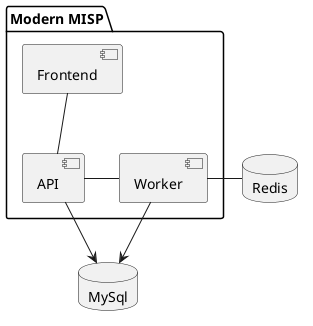

<!---
### ::: mmisp.api.config
    options:
      show_source: false
--->

### ::: mmisp.db.mypy
### ::: mmisp.db.all_models
### ::: mmisp.db.print_changes
### ::: mmisp.db.database
### ::: mmisp.db.models.taxonomy
### ::: mmisp.db.models.server
### ::: mmisp.db.models.feed
### ::: mmisp.db.models.attribute
### ::: mmisp.db.models.galaxy_cluster
### ::: mmisp.db.models.galaxy
### ::: mmisp.db.models.organisation
### ::: mmisp.db.models.tag
### ::: mmisp.db.models.event
### ::: mmisp.db.models.warninglist
### ::: mmisp.db.models.noticelist
### ::: mmisp.db.models.user
### ::: mmisp.db.models.sharing_group
### ::: mmisp.db.models.identity_provider
### ::: mmisp.db.models.auth_key
### ::: mmisp.db.models.sighting
### ::: mmisp.db.models.object
### ::: mmisp.db.models.role
### ::: mmisp.db.models.user_setting
### ::: mmisp.db.mixins
### ::: mmisp.db.config
### ::: mmisp.api_schemas.noticelists
### ::: mmisp.api_schemas.common
### ::: mmisp.api_schemas.tags
### ::: mmisp.api_schemas.roles
### ::: mmisp.api_schemas.sharing_groups
### ::: mmisp.api_schemas.authentication
### ::: mmisp.api_schemas.galaxies
### ::: mmisp.api_schemas.user_settings
### ::: mmisp.api_schemas.standard_status_response
### ::: mmisp.api_schemas.warninglists
### ::: mmisp.api_schemas.taxonomies
### ::: mmisp.api_schemas.attributes
### ::: mmisp.api_schemas.auth_keys
### ::: mmisp.api_schemas.organisations
### ::: mmisp.api_schemas.users
### ::: mmisp.api_schemas.objects
### ::: mmisp.api_schemas.feeds
### ::: mmisp.api_schemas.sightings
### ::: mmisp.api_schemas.events
### ::: mmisp.lib.attributes
### ::: mmisp.lib.permissions
